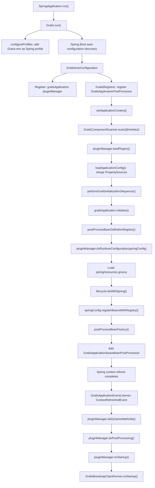

# Grace Boot

`grace-boot` is the **Spring Boot Auto-configuration layer** for the Grace Framework. It is the bridge between Spring Boot's startup mechanism and Grace's plugin/artefact system. The Grace README describes it as "an Auto-configuration [that] will load all other modules and plugins." Every Grace application starts through this module.


## Module Dependencies

It depends on `grace-core`, `grace-plugin-api`, and `grace-plugin-core` (the core plugin), plus `spring-boot`, `spring-boot-autoconfigure`, and `spring-webmvc`.


## Source Structure

```
grace-boot/src/main/groovy/
├── grails/boot/
│   ├── Grails.java                          # Main entry point (extends SpringApplication)
│   ├── GrailsBuilder.java                   # Fluent builder (extends SpringApplicationBuilder)
│   ├── GrailsBanner.java                    # Default ASCII banner
│   ├── GrailsResourceBanner.java            # Banner from grace-banner.txt
│   ├── GrailsPluginApplication.groovy       # Marker interface for plugin-as-app
│   ├── annotation/
│   │   └── GrailsComponentScan.java         # @GrailsComponentScan annotation
│   ├── config/
│   │   ├── GrailsAutoConfiguration.java     # @AutoConfiguration entry point
│   │   ├── GrailsApplicationPostProcessor.java  # Core BeanDefinitionRegistryPostProcessor
│   │   ├── GrailsApplicationEventListener.java  # ContextRefreshed/Closed handler
│   │   ├── GrailsComponentScanner.java      # Classpath scanner for @Artefact classes
│   │   └── GrailsComponentScanPackages.java # Package registry for scanning
│   └── web/servlet/
│       └── GrailsBootstrapClass.java        # Interface for Bootstrap artefacts
├── org/grails/boot/
│   ├── artefact/
│   │   ├── ApplicationArtefactHandler.groovy  # ArtefactHandler for Application class
│   │   └── BootstrapArtefactHandler.java      # ArtefactHandler for Bootstrap classes
│   ├── config/
│   │   └── GrailsBootstrapAutoConfiguration.java  # Auto-config for bootstrap runner
│   ├── context/
│   │   ├── GrailsApplicationPidFileWriter.java
│   │   ├── GrailsConfigurationWarningsApplicationContextInitializer.java
│   │   └── GrailsRunningStatusApplicationContextInitializer.java
│   ├── devtools/
│   │   ├── GrailsDevToolsConfiguration.java   # Spring Boot DevTools integration
│   │   ├── GrailsClassPathChangedEventListener.java
│   │   └── GrailsSourceCompiler.java
│   ├── web/servlet/
│   │   ├── DefaultGrailsBootstrapClass.java
│   │   ├── GrailsBootstrapClassRunner.java    # Runs Bootstrap artefacts on startup
│   │   └── GrailsConfigUtils.java
│   └── extension/
│       └── GrailsExtension.groovy
└── org/grails/compiler/boot/
    ├── ApplicationClassInjector.groovy        # AST injector for Application class
    └── BootInitializerClassInjector.groovy    # AST injector for Bootstrap classes
```


## Key APIs and Classes

### 1. `Grails` — The Application Entry Point

Extends Spring's `SpringApplication`. Every Grace application's `main()` method calls `Grails.run(Application, args)`. It:

- Configures the Grace banner (`grace-banner.txt` or the default `GrailsBanner`)
- Adds the current Grace `Environment` name as an active Spring profile
- Parses `--grails.*` system properties from command-line args
- Overrides `load()` to skip loading `@Artefact`-annotated classes directly into Spring (they are handled by the plugin system instead), while registering all primary sources as a `PRIMARY_SOURCES` singleton bean


### 2. `GrailsBuilder` — Fluent API

Extends `SpringApplicationBuilder` to produce `Grails` instances instead of plain `SpringApplication` instances. Used when building hierarchical application contexts (e.g., parent/child contexts for WAR deployment).


### 3. `GrailsAutoConfiguration` — The Auto-Configuration Entry Point

The `@AutoConfiguration` class discovered by Spring Boot via `META-INF/spring/org.springframework.boot.autoconfigure.AutoConfiguration.imports`. It registers three beans:

1. `grailsApplication` — a `DefaultGrailsApplication` (conditional on missing)
2. `pluginManager` — a `DefaultGrailsPluginManager` (conditional on missing)
3. `grailsApplicationPostProcessor` — registered via `GrailsRegistrar` (an `ImportBeanDefinitionRegistrar`) as an infrastructure-role bean


### 4. `GrailsApplicationPostProcessor` — The Core Initialization Engine

The most important class in `grace-boot`. It is a `BeanDefinitionRegistryPostProcessor` that drives the entire Grace initialization sequence. It is called by Spring during context refresh, before any regular beans are instantiated.

**Phase 1 — `setApplicationContext()`** → `initializeGrailsApplication()`:
- Scans for `@Artefact`-annotated classes via `GrailsComponentScanner`
- Identifies plugin classes and registers them with the plugin manager
- Calls `customizePluginManager()` (allows `GrailsPluginManagerCustomizer` beans to configure the manager)
- Calls `pluginManager.loadPlugins()` — discovers and loads all plugins
- Calls `loadApplicationConfig()` — merges plugin `PropertySource`s into the Spring `Environment` and builds the `Config` object
- Calls `customizeGrailsApplication()` (allows `GrailsApplicationCustomizer` beans to configure the application)
- Calls `performGrailsInitializationSequence()` — runs `doArtefactConfiguration()`, `grailsApplication.initialise()`, `registerProvidedArtefacts()`, `registerProvidedModules()`

**Phase 2 — `postProcessBeanDefinitionRegistry()`**:
- Calls `pluginManager.doRuntimeConfiguration(springConfig)` — each plugin's `doWithSpring` closure registers beans
- Loads `spring/resources.groovy` and `spring/resources.xml` if present
- Calls `doWithSpring()` on all `GrailsApplicationLifecycle` beans
- Registers all collected bean definitions into the Spring `BeanDefinitionRegistry`

**Phase 3 — `postProcessBeanFactory()`**:
- Adds `GrailsApplicationAwareBeanPostProcessor` (injects `GrailsApplication` into `GrailsApplicationAware` beans)
- Adds `PluginManagerAwareBeanPostProcessor` (injects `GrailsPluginManager` into `PluginManagerAware` beans)


### 5. `GrailsApplicationEventListener` — The Post-Refresh Handler

An `ApplicationListener<ApplicationContextEvent>` registered by `GrailsApplicationPostProcessor`. It handles two events:

**`ContextRefreshedEvent`** (after all beans are initialized):
1. Sets the GORM `MappingContext` on `GrailsApplication` if present
2. Calls `pluginManager.doDynamicMethods()` and `lifecycle.doWithDynamicMethods()` on all lifecycles
3. Calls `pluginManager.doPostProcessing()` and `lifecycle.doWithApplicationContext()` on all lifecycles
4. Calls `pluginManager.onStartup()` and `lifecycle.onStartup()` on all lifecycles

**`ContextClosedEvent`** (on shutdown):
- Calls `lifecycle.onShutdown()` on all lifecycles (in reverse order)
- Calls `pluginManager.shutdown()`
- Runs `ShutdownOperations` and clears `Holders`


### 6. `GrailsComponentScanner` + `@GrailsComponentScan`

`GrailsComponentScanner` uses Spring's `ClassPathScanningCandidateComponentProvider` to find all `@Artefact`-annotated classes in the configured base packages. It reads packages from `GrailsComponentScanPackages` (populated by `@GrailsComponentScan`) or falls back to Spring Boot's `AutoConfigurationPackages`.

`@GrailsComponentScan` is the annotation developers use to specify which packages to scan for artefacts:


### 7. `GrailsBootstrapAutoConfiguration` + `GrailsBootstrapClassRunner`

`GrailsBootstrapAutoConfiguration` is a second `@AutoConfiguration` (after `GrailsAutoConfiguration`) that registers `GrailsBootstrapClassRunner` as a bean in servlet web applications.

`GrailsBootstrapClassRunner` implements `GrailsApplicationLifecycle` and runs all `Bootstrap` artefact classes (`BootstrapArtefactHandler` type) on `onStartup()` and calls their `destroy()` methods on `onShutdown()`.


### 8. Artefact Handlers

Two `ArtefactHandler` implementations are registered in `META-INF/grails.factories`:

- `ApplicationArtefactHandler` — recognizes the `Application` class (the main Spring Boot application class)
- `BootstrapArtefactHandler` — recognizes `*Bootstrap` classes in `grails-app/init/`


### 9. AST Injectors

Two `ClassInjector` implementations are also registered in `grails.factories`:

- `ApplicationClassInjector` — at compile time, adds `@SpringBootApplication` to the `Application` class and injects a static initializer that sets `BuildSettings.MAIN_CLASS_NAME`
- `BootInitializerClassInjector` — injects `init(ctx)` and `destroy()` method stubs into `Bootstrap` classes


### 10. `GrailsDevToolsConfiguration`

An `@AutoConfiguration` that activates when Spring Boot DevTools is on the classpath. It registers `GrailsClassPathChangedEventListener`, which listens for classpath change events from DevTools and triggers recompilation of modified Groovy sources via `GrailsSourceCompiler`.


## Auto-Configurations Registered

```
grails.boot.config.GrailsAutoConfiguration
org.grails.boot.config.GrailsBootstrapAutoConfiguration
org.grails.boot.devtools.GrailsDevToolsConfiguration
```


## How It Works (Lifecycle)




## How It Is Used in Other Modules

`grace-boot` is a direct dependency of several modules:

| Module | Usage |
|--------|-------|
| `grace-boot-web` | Extends `GrailsAutoConfiguration` for web-specific setup |
| `grace-boot-hibernate` | Adds Hibernate/GORM auto-configuration on top of `GrailsAutoConfiguration` |
| `grace-boot-mongodb` | Adds MongoDB/GORM auto-configuration on top of `GrailsAutoConfiguration` |
| `grace-boot-plugin` | Provides plugin-as-application support using `GrailsPluginApplication` |
| `grace-console` | Uses `Grails` to start the Groovy console with a full Grace context |
| `grace-test` | Uses `GrailsAutoConfiguration` as the base for test contexts |
| `grace-test-support` | Subclasses `GrailsApplicationPostProcessor` as `TestRuntimeGrailsApplicationPostProcessor` to customize plugin loading for unit/integration tests |

The `grace-test-support` usage is particularly important — it subclasses `GrailsApplicationPostProcessor` to install an `IncludingPluginFilter` that loads only the plugins needed for a given test.

In summary, `grace-boot` provides three pillars: the **application entry point** (`Grails` + `GrailsBuilder`), the **initialization engine** (`GrailsAutoConfiguration` + `GrailsApplicationPostProcessor`), and the **lifecycle bridge** (`GrailsApplicationEventListener` + `GrailsBootstrapClassRunner`) that connects Spring Boot's context lifecycle to Grace's plugin system.
