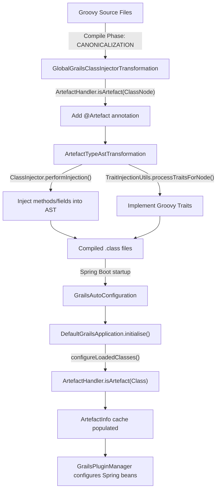

# Grace Core

`grace-core` is the central implementation module of the Grace Framework. It sits between the thin API layer (`grace-api`) and all functional modules, providing the concrete implementations of the framework's fundamental abstractions.

## Module Dependencies

`grace-core` depends on:

| Dependency | Role |
|------------|------|
| `grace-api` | Interfaces (`GrailsApplication`, `ArtefactHandler`, `GrailsClass`) |
| `grace-bootstrap` | Factories loader, settings, config loading |
| `grace-spring` | Spring integration utilities |
| `grace-util` | Name utilities, environment helpers |
| `grace.datastore.core` | GORM `MappingContext` integration |


## Key APIs and Classes

### 1. `DefaultGrailsApplication` — The Central Registry

The primary implementation of the `GrailsApplication` interface. It acts as the runtime registry for all application components (artefacts).

```
grails.core.DefaultGrailsApplication
  extends org.grails.core.AbstractGrailsApplication
    implements GrailsApplication, ApplicationContextAware, SmartApplicationListener
```

Key responsibilities:

- Holds all loaded classes and categorizes them by artefact type
- Manages a map of `ArtefactHandler` instances keyed by type name
- On `initialise()`, scans all loaded classes through every registered handler

The `configureLoadedClasses()` method is the core of artefact discovery — it iterates every class against every registered `ArtefactHandler` and builds the artefact cache.

Dynamic Groovy property access is also supported — `grailsApplication.controllerClasses` dynamically resolves to `getArtefacts("Controller")`.

### 2. `AbstractGrailsApplication` — Spring Lifecycle Bridge

Bridges `GrailsApplication` with Spring's `ApplicationContext` lifecycle. It listens for `ContextRefreshedEvent` to mark the context as initialized, and propagates config changes to all `ArtefactHandler` instances.

### 3. `AbstractGrailsClass` / `AbstractInjectableGrailsClass` — Artefact Metadata Wrappers

`AbstractGrailsClass` is the base for all `GrailsClass` wrappers. It computes and caches naming conventions (logical name, property name, natural name, short name) from the raw Java `Class<?>` object.

Every artefact-specific class (e.g., `DefaultGrailsDomainClass`, `DefaultGrailsControllerClass`) extends this base.

### 4. AST Transformation Infrastructure — Compile-Time Injection

This is one of the most important parts of `grace-core`. Three global AST transformations are registered as Groovy services.

**`GlobalGrailsClassInjectorTransformation`** — runs at `CANONICALIZATION` phase. For every source file in the project, it:

1. Checks if the class implements `ArtefactHandler`, `ClassInjector`, or `TraitInjector` and registers it in `META-INF/grails.factories`
2. Runs all registered `ArtefactHandler` instances against each class node
3. If matched, adds `@Artefact` annotation and calls `ArtefactTypeAstTransformation` + `TraitInjectionUtils`

**`GlobalGrailsPluginTransformation`** — also runs at `CANONICALIZATION`. For plugin projects, it annotates artefact classes with `@GrailsPlugin` metadata and generates `META-INF/grails-plugin.xml`.

**`ArtefactTypeAstTransformation`** — handles the `@Artefact` annotation directly. It calls all `ClassInjector` instances (ordered) and `TraitInjectionUtils` to inject behavior into the class node at compile time.

**`GrailsASTUtils`** — a large utility class with helper methods for working with Groovy AST nodes (adding annotations, checking class hierarchies, injecting methods, etc.).

### 5. `GrailsApplicationAwareBeanPostProcessor` — Spring DI Bridge

A Spring `BeanPostProcessor` that automatically injects the `GrailsApplication` instance into any Spring bean implementing `GrailsApplicationAware`, and the `Config` into any bean implementing `GrailsConfigurationAware`.

### 6. Resource I/O Utilities

`grace-core/src/main/groovy/org/grails/core/io/` provides:

- `ResourceLocator` / `DefaultResourceLocator` — locates Spring `Resource` objects for a given class or path
- `MockResourceLoader`, `MockStringResourceLoader`, `SimpleMapResourceLoader` — in-memory resource loaders for testing
- `StaticResourceLocator` — a no-op locator for static contexts

---

## How It Works (Lifecycle)



---

## How It Is Used in Other Modules

`grace-core` is a dependency of **35+ modules** across the framework:

Every functional module depends on it:

| Module | What it uses from grace-core |
|--------|------------------------------|
| `grace-boot` | `DefaultGrailsApplication`, `AbstractGrailsApplication` |
| `grace-web`, `grace-web-mvc` | `GrailsApplicationAware`, artefact lookup |
| `grace-plugin-*` (all plugins) | `AbstractGrailsClass`, `DefaultGrailsApplication`, AST transformers |
| `grace-gsp`, `grace-taglib` | `GrailsApplicationAwareBeanPostProcessor`, `GrailsClass` |
| `grace-views-core`, `grace-views-json` | `GrailsApplicationAware`, `GrailsClass` |
| `grace-test-support` | `DefaultGrailsApplication` for test context setup |
| `grace-shell` | `GrailsASTUtils`, `ArtefactTypeAstTransformation` |


In summary, `grace-core` provides three pillars that everything else builds on: the **artefact registry** (`DefaultGrailsApplication`), the **compile-time injection engine** (AST transformations), and the **Spring integration glue** (`GrailsApplicationAwareBeanPostProcessor`).
