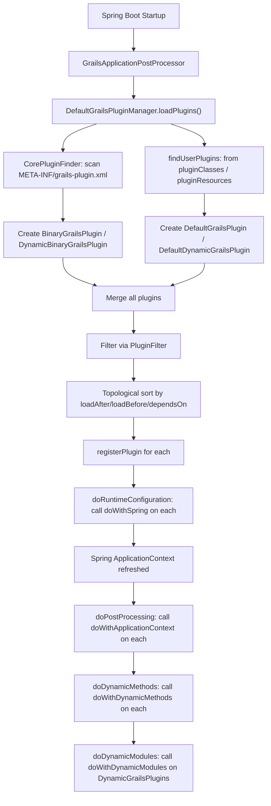

# Grace Plugin API

`grace-plugin-api` is the plugin system backbone of the Grace Framework. It defines the complete plugin architecture: the contracts plugins must fulfill, the runtime that loads and manages them, and the lifecycle hooks that connect plugins to the Spring `ApplicationContext`.

## Module Dependencies

It depends on `grace-api`, `grace-bootstrap`, `grace-spring`, `grace-util`, and notably `spring-boot-autoconfigure` — reflecting that a Grace plugin is an extended Spring Boot Starter.

## Source Structure

```
grace-plugin-api/src/main/groovy/
├── grails/plugins/
│   ├── GrailsPlugin.java              # Core plugin interface
│   ├── GrailsPluginManager.java       # Manager interface
│   ├── GrailsPluginInfo.java          # Plugin metadata interface
│   ├── Plugin.groovy                  # Groovy base class for plugins
│   ├── DynamicGrailsPlugin.java       # Extension for dynamic modules
│   ├── DynamicPlugin.groovy           # Groovy base class for dynamic plugins
│   ├── DefaultGrailsPluginManager.java
│   ├── GrailsVersionUtils.groovy
│   ├── VersionComparator.groovy
│   ├── PluginFilter.java
│   ├── PluginManagerAware.java
│   ├── ModuleDescriptor.java
│   ├── ModuleDescriptorFactory.java
│   └── ...
└── org/grails/plugins/
    ├── AbstractGrailsPlugin.java
    ├── AbstractGrailsPluginManager.java
    ├── DefaultGrailsPlugin.java
    ├── BinaryGrailsPlugin.java
    ├── DefaultDynamicGrailsPlugin.java
    ├── DynamicBinaryGrailsPlugin.java
    ├── CorePluginFinder.java
    ├── GrailsPluginArtefactHandler.java
    ├── GrailsPluginClass.java
    ├── IncludingPluginFilter.java
    ├── ExcludingPluginFilter.java
    └── ...
```


## Key APIs and Classes

### 1. `GrailsPlugin` — The Core Plugin Interface

The central contract. Every plugin in the system is represented as a `GrailsPlugin` at runtime. It extends `GrailsPluginInfo`, `ApplicationContextAware`, `Comparable`, and Spring's `Ordered`.

Key lifecycle method constants and declarations:

Key lifecycle methods:

The interface defines these plugin descriptor properties:

| Property | Purpose |
|----------|---------|
| `doWithSpring` | Closure to register Spring beans |
| `doWithApplicationContext` | Called after `ApplicationContext` is built |
| `doWithDynamicMethods` | Registers Groovy dynamic methods at runtime |
| `onChange` | Called when a watched resource changes |
| `onConfigChange` | Called when configuration changes |
| `onShutdown` | Called on application shutdown |
| `dependsOn` | Map of required plugin names → versions |
| `loadAfter` / `loadBefore` | Soft ordering hints |
| `evict` | Plugins to remove when this one loads |
| `watchedResources` | Ant-style paths to monitor for changes |
| `environments` / `scopes` | Conditional activation |


### 2. `Plugin` — The Groovy Base Class

The recommended superclass for all plugin implementations. It implements `GrailsApplicationLifecycle`, `GrailsApplicationAware`, `ApplicationContextAware`, and `PluginManagerAware`, providing injected access to `grailsApplication`, `applicationContext`, `pluginManager`, `config`, and `environment`.

A typical plugin looks like:

```groovy
class InterceptorsGrailsPlugin extends Plugin implements PriorityOrdered {
    def version = GrailsUtil.getGrailsVersion()
    def dependsOn = [controllers: version, urlMappings: version]
    def loadAfter = ['controllers']

    @Override
    Closure doWithSpring() { { ->
        // register Spring beans using BeanBuilder DSL
    } }

    @Override
    void doWithApplicationContext() { /* post-init */ }

    @Override
    void onChange(Map<String, Object> event) { /* hot reload */ }
}
```

### 3. `GrailsPluginManager` — The Manager Interface

Orchestrates the full plugin lifecycle. Key methods:

Notable methods:

| Method | Purpose |
|--------|---------|
| `loadPlugins()` | Discovers and loads all plugins |
| `doRuntimeConfiguration(springConfig)` | Calls `doWithSpring` on all plugins |
| `doPostProcessing(ctx)` | Calls `doWithApplicationContext` on all plugins |
| `doDynamicMethods()` | Calls `doWithDynamicMethods` on all plugins |
| `doDynamicModules()` | Calls `doWithDynamicModules` on dynamic plugins |
| `registerProvidedArtefacts(app)` | Registers plugin-provided artefact classes |
| `registerProvidedModules()` | Registers `ModuleDescriptor` types from dynamic plugins |
| `informObservers(pluginName, event)` | Notifies observing plugins of changes |
| `getModuleDescriptors(predicate)` | Queries installed dynamic modules |

### 4. `DefaultGrailsPluginManager` — The Main Implementation

The concrete implementation of `GrailsPluginManager`. Its `loadPlugins()` method drives the entire plugin loading sequence:

Plugin ordering uses **topological sort** based on `loadAfter`/`loadBefore` declarations:

It distinguishes **core plugins** (discovered from `META-INF/grails-plugin.xml` on the classpath) from **user plugins** (passed in directly):

Plugin instantiation dispatches to the right implementation class:

### 5. `CorePluginFinder` — Binary Plugin Discovery

Scans the classpath for `META-INF/grails-plugin.xml` descriptors (one per plugin JAR) to discover core/binary plugins:

### 6. `BinaryGrailsPlugin` — Pre-compiled Plugin

Represents a plugin distributed as a compiled JAR. It reads `META-INF/grails-plugin.xml` and `gsp/views.properties` from the JAR to serve pre-compiled views and artefacts:

### 7. `DynamicGrailsPlugin` / `DynamicPlugin` — Dynamic Module System

Grace's extension to the plugin model. A `DynamicGrailsPlugin` can declare `providedModules` (a list/map of `ModuleDescriptor` classes) and implement `doWithDynamicModules()` to register module instances at runtime:

The four concrete implementations are:

| Class | Description |
|-------|-------------|
| `DefaultGrailsPlugin` | Standard Groovy source plugin |
| `BinaryGrailsPlugin` | Pre-compiled JAR plugin |
| `DefaultDynamicGrailsPlugin` | Source plugin + dynamic modules |
| `DynamicBinaryGrailsPlugin` | Binary plugin + dynamic modules |

### 8. `GrailsPluginArtefactHandler` — Plugin as Artefact

Registers plugin classes themselves as artefacts of type `"GrailsPlugin"`, enabling `grailsApplication.getArtefacts("GrailsPlugin")` to enumerate all loaded plugin classes:

### 9. Version Utilities

`GrailsVersionUtils` and `VersionComparator` handle version range strings like `"1.1 > *"` used in `dependsOn` declarations. `DefaultGrailsPluginManager` uses these to validate compatibility:

## How It Works (Lifecycle)



## How It Is Used in Other Modules

`grace-plugin-api` is a `compileOnly` or `api` dependency of **33+ modules**. Every module that defines a `*GrailsPlugin.groovy` class depends on it:

Examples of modules using it:

| Module | Usage |
|--------|-------|
| `grace-boot` | `GrailsApplicationPostProcessor` drives `loadPlugins()`, `doRuntimeConfiguration()`, `doPostProcessing()` |
| `grace-core` | `compileOnly` — uses `GrailsPlugin`, `GrailsPluginManager` interfaces |
| `grace-plugin-core` | `CoreGrailsPlugin extends Plugin` — registers core Spring beans |
| `grace-plugin-i18n` | `I18nGrailsPlugin extends Plugin` — configures message sources |
| `grace-plugin-interceptors` | `InterceptorsGrailsPlugin extends Plugin` — registers interceptor beans |
| `grace-plugin-gsp` | `GroovyPagesGrailsPlugin extends Plugin` — configures GSP engine |
| `grace-views-core` | `PluginAwareTemplateResolver` uses `GrailsPluginManager` to search binary plugins for templates |
| `grace-web`, `grace-web-mvc` | Use `PluginManagerAware` to access the plugin manager |
| All `grace-plugin-*` modules | Each defines a `Plugin` subclass as its entry point |

The `grace-boot` module is the primary consumer — its `GrailsApplicationPostProcessor` is the `BeanDefinitionRegistryPostProcessor` that calls `pluginManager.doRuntimeConfiguration(springConfig)` to register all plugin-contributed Spring beans before the context is refreshed.
