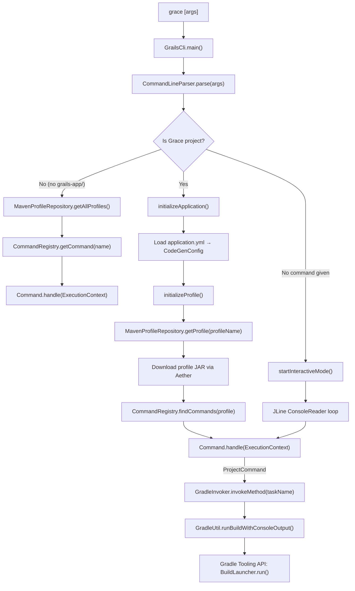

# Grace Shell

`grace-shell` is the Grace CLI — the `grace` command-line tool that developers use to create applications, run them, generate code, and interact with the project. It is built as a standalone executable application (Gradle `application` plugin) with `GrailsCli` as the main class.


## Module Dependencies

Key external dependencies:

| Dependency | Role |
|------------|------|
| `jline` | Interactive terminal with tab completion and history |
| `jansi` | ANSI color output |
| `gradle.tooling.api` | Invokes Gradle builds from within the CLI |
| `maven.resolver.*` (Aether) | Resolves profile JARs from Maven repositories |
| `ant` / `groovy-ant` | File operations during project scaffolding |


## Source Structure

```
grace-shell/src/main/groovy/org/grails/cli/
├── GrailsCli.groovy                    # Main entry point
├── command/                            # Command API
│   ├── Command.java                    # Core interface
│   ├── ExecutionContext.java           # Context passed to commands
│   ├── ProjectContext.java             # Project-level context
│   ├── CommandRegistry.groovy          # ServiceLoader-based registry
│   ├── CommandDescription.groovy       # Metadata (flags, args, usage)
│   ├── app/                            # create-app, run-app, stop-app, template
│   ├── gradle/                         # assemble, clean, compile, gradle
│   ├── generate/                       # generate command
│   ├── console/, shell/                # console, shell commands
│   ├── profile/, plugin/               # profile/plugin management commands
│   └── completers/                     # JLine tab completers
├── profile/                            # Profile system
│   ├── Profile.java                    # Profile interface
│   ├── AbstractProfile.groovy          # Base implementation
│   ├── DefaultProfile.groovy           # Default profile
│   ├── ProfileRepository.groovy        # Repository interface
│   ├── commands/                       # Multi-step & Groovy script commands
│   ├── steps/                          # Step types (render, mkdir, gradle, execute)
│   └── repository/                     # MavenProfileRepository, StaticJarProfileRepository
├── gradle/                             # Gradle Tooling API integration
│   ├── GradleInvoker.groovy
│   ├── GradleAsyncInvoker.groovy
│   ├── GradleUtil.groovy
│   ├── ClasspathBuildAction.groovy
│   └── FetchAllTaskSelectorsBuildAction.java
├── generator/                          # Code generators
│   ├── DomainGenerator.groovy
│   ├── ControllerGenerator.groovy
│   ├── ServiceGenerator.groovy
│   └── ...
└── compiler/                           # Groovy compiler infrastructure
    ├── GroovyCompiler.java
    ├── dependencies/
    └── grape/
```


## Key APIs and Classes

### 1. `GrailsCli` — The Main Entry Point

The top-level class. Its `main()` method is the entry point for the `grace` binary. It:
- Parses the command line using `CommandLineParser`
- Handles `--version`, `--help` flags directly
- Detects whether the CWD is a Grace project (by checking for `grails-app/` directory)
- Dispatches to either a global command (from `CommandRegistry`) or a profile-specific command
- Runs an interactive REPL loop with JLine when no command is given 

The interactive mode loop reads input from JLine's `ConsoleReader`, dispatches each line to `handleCommand()`, and supports Ctrl-C cancellation via a `Future`-based mechanism.

### 2. `Command` — The Core Interface

Every CLI command implements this interface. It provides a `name`, a `CommandDescription` (flags, arguments, usage text, synonyms), and a `handle(ExecutionContext)` method. Commands can optionally have a `namespace` (e.g., `app:template`).

Sub-interfaces:
- `ProjectCommand` — command that requires a project context (CWD must be a Grace project)
- `GlobalCommand` — command available everywhere (e.g., `list-profiles`, `help`)
- `ProfileCommand` — command that requires a `Profile` to be set

### 3. `ExecutionContext` / `ProjectContext`

`ExecutionContext` extends `ProjectContext` and is the object passed to every `Command.handle()` call. It provides the parsed `CommandLine`, the project base directory, the `GrailsConsole`, the application config, and cancellation support.

### 4. `CommandRegistry` — ServiceLoader-Based Discovery

Commands are registered via `META-INF/services/org.grails.cli.command.Command`. `CommandRegistry` loads them at class-initialization time using `ServiceLoader`. It also loads `CommandFactory` instances for profile-specific commands.

The 23 built-in commands registered in the services file.

### 5. `Profile` / `AbstractProfile` — Project Type System

A `Profile` defines the code generation and command execution policy for a project type (e.g., `web`, `web-plugin`, `rest-api`). Profiles are distributed as Maven JARs containing.
- `profile.yml` — metadata, dependencies, features, build plugins
- `skeleton/` — template files to copy when creating a new app
- `commands/` — YAML or Groovy script command definitions

`AbstractProfile` handles command inheritance (profiles can `extend` other profiles), feature resolution, and cosine-similarity-based "did you mean?" suggestions for unknown commands.

### 6. `MavenProfileRepository` — Profile Resolution via Aether

Resolves profile JARs from Maven Central (or local `.m2`) using the Eclipse Aether library. When `grace create-app --profile=web` is run, `MavenProfileRepository` downloads the `grace-profile-web` JAR and registers it as a `Profile`.

### 7. `GradleInvoker` / `GradleUtil` — Gradle Tooling API Bridge

Most project-level commands (`run-app`, `assemble`, `compile`, `console`, `shell`) don't execute logic directly — they delegate to Gradle tasks via the Gradle Tooling API. `GradleInvoker` uses Groovy's `invokeMethod` to map any method call to a Gradle task name.

`GradleUtil` manages the `ProjectConnection` lifecycle and wires console output.

`GradleAsyncInvoker` wraps `GradleInvoker` to submit tasks to a thread pool — used in interactive mode so the CLI stays responsive while a build runs.

`ClasspathBuildAction` and `FetchAllTaskSelectorsBuildAction` are `BuildAction` implementations that query the Gradle model (classpath, task names) without running a build.

### 8. `GroovyScriptCommand` — Script-Based Commands

Profile commands can be written as Groovy scripts. `GroovyScriptCommand` is the base class — it uses `@Delegate` to expose `ExecutionContext`, `TemplateRenderer`, `FileSystemInteraction`, and `ConsoleLogger` directly in the script body. It also exposes a `gradle` property for invoking Gradle tasks.

### 9. `DefaultMultiStepCommand` — YAML-Defined Commands

Profile commands can also be defined in YAML (inside `profile.yml` or separate command YAML files). `DefaultMultiStepCommand` parses the YAML map and creates a list of `Step` instances. Step types include:

| Step | Action |
|------|--------|
| `RenderStep` | Renders a template file into the project |
| `MkdirStep` | Creates a directory |
| `GradleStep` | Runs a Gradle task |
| `ExecuteStep` | Runs an OS command |

### 10. Generator Classes

`grace-shell` includes built-in code generators in `org.grails.cli.generator`:

| Generator | Generates |
|-----------|-----------|
| `DomainGenerator` | Domain class + Spec |
| `ControllerGenerator` | Controller + Spec |
| `ServiceGenerator` | Service + Spec |
| `InterceptorGenerator` | Interceptor + Spec |
| `TaglibGenerator` | TagLib + Spec |
| `ViewsGenerator` | GSP views |
| `I18nGenerator` | i18n message files |
| `ScriptGenerator` | Groovy scripts |
| `PluginGenerator` | Plugin descriptor |

### 11. `GradleTaskCommandAdapter` — ApplicationCommand Bridge

`ApplicationCommand` instances (defined in `grace-cli`) can be adapted into CLI commands via `GradleTaskCommandAdapter`, which maps the command name to a Gradle task using `GrailsNameUtils.getPropertyNameForLowerCaseHyphenSeparatedName`.


## How It Works (Lifecycle)




## How It Is Used in Other Modules

`grace-shell` is a **standalone executable** — it is not a library that other runtime modules depend on. Only two modules in the framework depend on it:

- `grace-gradle-plugin` — uses it to provide the `grace` CLI integration in Gradle builds
- `grace-plugin-database-migration` — uses it for migration-related CLI commands

The `grace-gradle-plugin` registers `console` and `shell` Gradle tasks that launch `grails.ui.console.GrailsConsole` and `grails.ui.shell.GrailsShell` respectively, which are separate from the CLI itself.

The `ShellCommand` and `ConsoleCommand` in `grace-shell` delegate to these Gradle tasks via `GradleInvoker`.

In summary, `grace-shell` provides three pillars: the **interactive CLI** (`GrailsCli` + `CommandRegistry`), the **project scaffolding engine** (`CreateAppCommand` + `Profile` + `MavenProfileRepository`), and the **Gradle bridge** (`GradleInvoker` + `GradleUtil`) that delegates most project-level operations to the Gradle build system.
