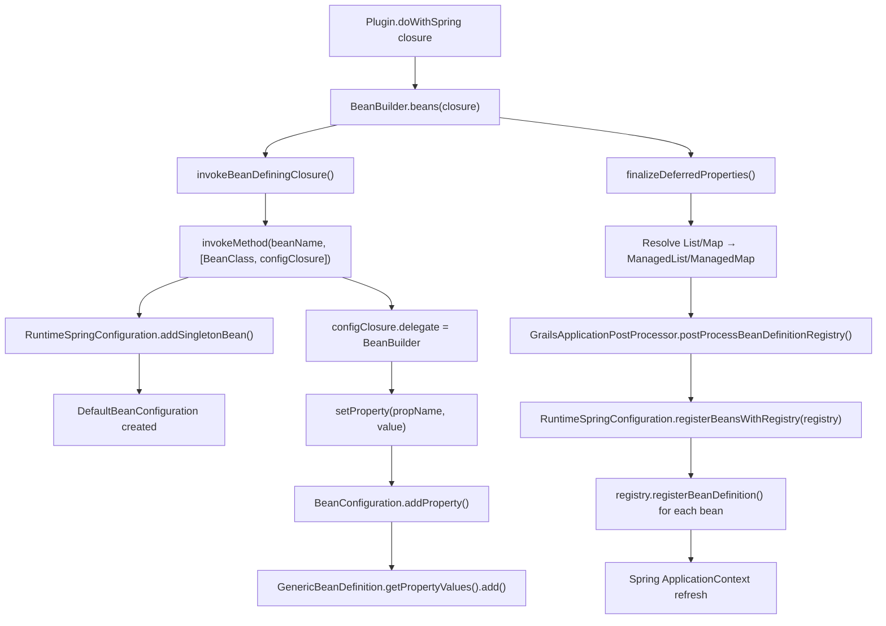

# Grace Spring

`grace-spring` is the **Spring DSL and runtime bean configuration layer** of the Grace Framework. It provides the Groovy-based `BeanBuilder` DSL that plugins use in `doWithSpring` closures, and the `RuntimeSpringConfiguration` infrastructure that accumulates bean definitions and registers them with the Spring `ApplicationContext`.


## Module Dependencies

Only `groovy-xml`, `spring-core`, `spring-beans`, and `spring-context` are `api` dependencies. `spring-aop`, `spring-tx`, and `spring-web` are `compileOnly` — making this a very lightweight module.


## Source Structure

```
grace-spring/src/main/groovy/
├── grails/spring/
│   ├── BeanBuilder.java              # Groovy DSL for Spring bean definitions
│   └── DynamicElementReader.groovy   # Spring XML namespace support in the DSL
└── org/grails/spring/
    ├── BeanConfiguration.java                    # Interface: a single bean's config
    ├── DefaultBeanConfiguration.java             # Implementation of BeanConfiguration
    ├── RuntimeSpringConfiguration.java           # Interface: accumulator for all beans
    ├── DefaultRuntimeSpringConfiguration.java    # Implementation of RuntimeSpringConfiguration
    ├── GrailsApplicationContext.java             # GenericApplicationContext + Groovy access
    ├── GrailsContextEvent.java                   # ApplicationEvent for Grace context events
    ├── RuntimeSpringConfigUtilities.java         # Loads spring/resources.groovy
    ├── TypeSpecifyableTransactionProxyFactoryBean.java
    ├── aop/autoproxy/                            # AOP auto-proxy support
    ├── beans/factory/                            # Bean factory support
    ├── beans/support/                            # Bean support utilities
    └── context/ApplicationContextExtension.groovy # Groovy extension methods for ApplicationContext
```


## Key APIs and Classes

### 1. `BeanBuilder` — The Groovy Spring DSL

The central class of the module. It is a `GroovyObjectSupport` that overrides `invokeMethod`, `getProperty`, and `setProperty` to intercept Groovy method calls and translate them into Spring `BeanDefinition` registrations. This is what makes the `doWithSpring` DSL work:

```groovy
// Inside a Plugin's doWithSpring closure:
myService(MyService) {
    dataSource = ref('dataSource')   // setProperty → addProperty on BeanConfiguration
    timeout = 30
}
```

- `invokeMethod(name, args)` — when `name` is a class, creates a `BeanConfiguration` via `RuntimeSpringConfiguration.addSingletonBean()`
- `getProperty(name)` — returns a `RuntimeBeanReference` for an already-defined bean (enabling `ref` syntax)
- `setProperty(name, value)` — sets a property on the current `BeanConfiguration`
- `beans(Closure)` — entry point for a bean-defining block
- `importBeans(String)` — imports beans from XML or Groovy resource patterns
- `xmlns(Map)` — registers Spring XML namespace handlers for use in the DSL
- `createApplicationContext()` — finalizes and refreshes the `ApplicationContext`
- `registerBeans(BeanDefinitionRegistry)` — registers all accumulated beans into an existing registry


### 2. `DynamicElementReader` — Spring XML Namespace Support

Used by `BeanBuilder` to handle Spring XML namespace expressions (e.g., `aop`, `tx`, `context`) within the Groovy DSL. It uses `StreamingMarkupBuilder` to serialize the Groovy closure call into an XML element, then delegates to the appropriate Spring `NamespaceHandler` to parse it.


### 3. `RuntimeSpringConfiguration` — Bean Accumulator Interface

The interface that `BeanBuilder` writes into. It accumulates `BeanConfiguration` objects and `BeanDefinition` instances, then registers them all with a `BeanDefinitionRegistry` at once. Key methods:

| Method | Purpose |
|--------|---------|
| `addSingletonBean(name, clazz)` | Add a named singleton bean |
| `addPrototypeBean(name, clazz)` | Add a named prototype bean |
| `addAbstractBean(name)` | Add an abstract (parent) bean |
| `addBeanDefinition(name, bd)` | Add a raw Spring `BeanDefinition` |
| `getBeanConfig(name)` | Retrieve a `BeanConfiguration` by name |
| `containsBean(name)` | Check if a bean is registered |
| `registerBeansWithRegistry(registry)` | Flush all beans into a `BeanDefinitionRegistry` |
| `registerBeansWithContext(ctx)` | Flush all beans into a `GenericApplicationContext` |
| `registerBeansWithConfig(target)` | Merge into another `RuntimeSpringConfiguration` |
| `addAlias(alias, beanName)` | Register a bean alias |


### 4. `DefaultRuntimeSpringConfiguration` — Bean Accumulator Implementation

The concrete implementation. It maintains three internal maps:
- `beanConfigs` — `Map<String, BeanConfiguration>` for DSL-defined beans
- `beanDefinitions` — `Map<String, BeanDefinition>` for raw Spring `BeanDefinition` instances
- `beanNames` — `LinkedHashSet<String>` preserving insertion order

`registerBeansWithRegistry()` iterates all three and calls `registry.registerBeanDefinition()` for each. It creates a `GrailsApplicationContext` (not a standard `GenericApplicationContext`) as its backing context.


### 5. `BeanConfiguration` — Single Bean Config Interface

A fluent builder interface wrapping a Spring `AbstractBeanDefinition`. It is what `BeanBuilder` returns when you define a bean, and what `RuntimeSpringConfiguration` stores internally.

`DefaultBeanConfiguration` implements it as a `GroovyObjectSupport`, so property assignments on it (e.g., `bean.timeout = 30`) are intercepted and stored as `PropertyValue` entries on the underlying `GenericBeanDefinition`.


### 6. `GrailsApplicationContext` — Groovy-Aware ApplicationContext

Extends Spring's `GenericApplicationContext` and implements `GroovyObject`. This allows beans to be retrieved with dot-dereference syntax in Groovy code (`ctx.myService` instead of `ctx.getBean('myService')`). It also:
- Overrides `setProperty` to accept `BeanDefinition` assignments (enabling hot-reload of bean definitions)
- Registers the Spring `Environment` under the name `springEnvironment` (instead of the default `environment`) to avoid conflicts with Grace's own `Environment` class
- Overrides `assertBeanFactoryActive()` as a no-op to prevent excessive synchronization


### 7. `RuntimeSpringConfigUtilities` — `spring/resources.groovy` Loader

A utility class that handles loading the application's `spring/resources.groovy` (or `spring/resources.xml`) file. It compiles the Groovy script, extracts the `beans` closure, and feeds it into a `BeanBuilder`. It also caches the `BeanBuilder` instance for reuse during hot-reload.


### 8. `GrailsContextEvent` — Context Lifecycle Event

A Spring `ApplicationEvent` published on the `WebApplicationContext` to signal Grace-specific lifecycle milestones (currently only `DYNAMIC_METHODS_REGISTERED = 0`).


### 9. `TypeSpecifyableTransactionProxyFactoryBean`

Extends Spring's `TransactionProxyFactoryBean` to allow the proxied type to be declared explicitly. This is needed when creating scoped proxies of transactional service beans — the scoped proxy needs to know the type before the transactional proxy has instantiated the underlying service.


## How It Works




## How It Is Used in Other Modules

`grace-spring` is a direct `api` dependency of **11 modules**:

| Module | Usage |
|--------|-------|
| `grace-core` | `BeanBuilder` in `AbstractGrailsApplication`; `RuntimeSpringConfiguration` in artefact configuration |
| `grace-plugin-api` | `BeanBuilder` is the DSL used in every plugin's `doWithSpring` closure |
| `grace-boot` | `DefaultRuntimeSpringConfiguration` + `RuntimeSpringConfigUtilities` in `GrailsApplicationPostProcessor.postProcessBeanDefinitionRegistry()` |
| `grace-plugin-core` | `DefaultRuntimeSpringConfiguration` + `RuntimeSpringConfigUtilities` in `CoreGrailsPlugin.onChange()` for hot-reload |
| `grace-web` | Extends `BeanBuilder` as `WebBeanBuilder` (uses `WebRuntimeSpringConfiguration`); `GrailsApplicationContext` used as the web app context |
| `grace-web-gsp` | Uses `BeanBuilder` for GSP-related bean registration |
| `grace-web-taglib` | Uses `BeanBuilder` for tag library bean registration |
| `grace-test-suite-*` | Uses `BeanBuilder` directly in tests (e.g., `DataSourcesGrailsPluginTests`) |

The most critical usage is in `grace-boot`'s `GrailsApplicationPostProcessor`, which creates a `DefaultRuntimeSpringConfiguration`, passes it to every plugin's `doWithSpring` via `pluginManager.doRuntimeConfiguration()`, then calls `springConfig.registerBeansWithRegistry(registry)` to flush all plugin-contributed beans into the Spring `BeanDefinitionRegistry` before the context is refreshed.

`grace-web` extends `BeanBuilder` with `WebBeanBuilder`, which overrides `createRuntimeSpringConfiguration()` to return a `WebRuntimeSpringConfiguration` (a subclass that creates a `GrailsWebApplicationContext` instead of a plain `GrailsApplicationContext`).

In summary, `grace-spring` provides three pillars: the **Groovy Spring DSL** (`BeanBuilder` + `DynamicElementReader`), the **bean accumulator** (`RuntimeSpringConfiguration` + `DefaultRuntimeSpringConfiguration`), and the **Groovy-aware ApplicationContext** (`GrailsApplicationContext`) that makes the entire Grace plugin bean registration system work.
