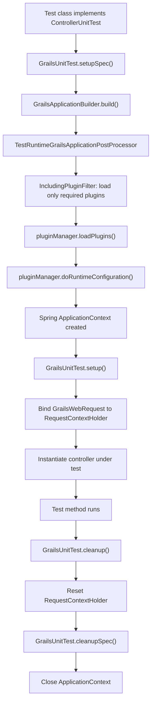

# Grace Test Support

`grace-test-support` is the **published testing infrastructure library** for Grace application developers. Unlike the `grace-test-suite-*` modules (which are internal and unpublished), this module is a first-class artifact that application and plugin developers add to their `testImplementation` classpath to write unit and integration tests.


## Module Dependencies

All dependencies are declared as `api` (transitive), so any project depending on `grace-test-support` automatically gets the full testing stack. Key groupings:

| Group | Dependencies |
|-------|--------------|
| Grace plugins | `grace-plugin-codecs`, `grace-plugin-core`, `grace-plugin-databinding`, `grace-plugin-domain-class`, `grace-plugin-i18n`, `grace-plugin-interceptors`, `grace-plugin-rest`, `grace-plugin-gsp`, `grace-plugin-taglibs` |
| GORM | `grace.datastore.gorm`, `grace.datastore.gorm.support`, `grace.datastore.gorm.test` |
| Testing frameworks | `spock.core`, `spock.spring`, `junit.jupiter.api`, `junit.platform.runner`, `groovy.test.junit5` |
| Web | `grace-web-gsp`, `grace-views-json`, `jakarta.servlet` |
| Spring | `spring.test`, `spring.boot.test` |


## Source Structure

```
grace-test-support/src/main/groovy/
├── grails/
│   └── testing/
│       ├── gorm/          # DataTest, DomainUnitTest
│       ├── web/           # ControllerUnitTest, InterceptorUnitTest,
│       │                  # TagLibUnitTest, UrlMappingsUnitTest, ViewUnitTest
│       └── services/      # ServiceUnitTest
└── org/grails/
    └── testing/
        └── GrailsApplicationBuilder.groovy
```


## Key APIs and Classes

### 1. `GrailsUnitTest` — Base Trait

The root trait for all Grace unit tests. It sets up a minimal `GrailsApplication` context using `GrailsApplicationBuilder` and provides access to `grailsApplication`, `applicationContext`, and `config`. All other testing traits extend or compose with this one.

### 2. `grails.testing.gorm.DataTest` — Domain Class Mocking

The most widely used trait. It provides `mockDomain(Class)` and `mockDomains(Class...)` methods that set up an in-memory GORM session (backed by `grace.datastore.gorm.test`) for the specified domain classes. Tests can call GORM dynamic finders, criteria queries, and `save()`/`delete()` without a real database.

Usage pattern seen in `grace-test-suite-persistence`.

### 3. `grails.testing.gorm.DomainUnitTest<T>` — Single Domain Test

A specialization of `DataTest` for testing a single domain class `T`. It automatically calls `mockDomain(T)` and exposes a `domain` property of type `T` for convenience.

### 4. `grails.testing.web.controllers.ControllerUnitTest<T>` — Controller Testing

Sets up a mock web request/response environment (`GrailsWebRequest`, `MockHttpServletRequest`, `MockHttpServletResponse`) and instantiates the controller under test as `controller`. Provides `model`, `view`, `response`, `request`, `flash`, `params`, and `render`/`redirect` result inspection.

### 5. `grails.testing.web.interceptor.InterceptorUnitTest<T>` — Interceptor Testing

Sets up the same mock web environment as `ControllerUnitTest` and provides `interceptor` (the instance under test), plus `withRequest {}` and `withInterceptors {}` helpers to simulate request matching.

### 6. `grails.testing.web.taglib.TagLibUnitTest<T>` — TagLib Testing

Provides `applyTemplate(String)` and `render(tag: ...)` helpers that render GSP tag expressions in an isolated context and return the output as a `String`.

### 7. `grails.testing.services.ServiceUnitTest<T>` — Service Testing

Provides `service` (the instance under test) and `defineBeans {}` to register additional Spring beans needed by the service.

### 8. `grails.testing.web.UrlMappingsUnitTest` — URL Mappings Testing

Provides `assertForwardUrlMapping`, `assertReverseUrlMapping`, and `verifyUrlMapping` helpers that exercise the URL mapping DSL without a running server.

### 9. `grails.testing.web.GrailsWebUnitTest` — Web Base Trait

The base trait for all web-related unit tests. It initializes `GrailsWebRequest`, binds it to `RequestContextHolder`, and tears it down after each test.

### 10. `GrailsApplicationBuilder` / `TestRuntimeGrailsApplicationPostProcessor`

`GrailsApplicationBuilder` constructs a `GrailsApplication` for test contexts. Its inner class `TestRuntimeGrailsApplicationPostProcessor` extends `GrailsApplicationPostProcessor` (from `grace-boot`) to customize plugin loading for tests — it installs an `IncludingPluginFilter` so only the plugins needed for a given test are loaded, and disables external bean loading and reloading.


## How It Works



For `DataTest`, the GORM in-memory store is initialized via `grace.datastore.gorm.test` — it creates a `SimpleMapDatastore` that implements the full GORM API without a real database. Each `mockDomain()` call registers the domain class with the datastore and sets up the `GrailsDomainClass` artefact.


## How It Is Used in Other Modules

`grace-test-support` is a `testImplementation` dependency of all three internal test suite modules and several plugin modules:

| Module | Usage |
|--------|-------|
| `grace-test-suite-uber` | `ControllerUnitTest`, `ServiceUnitTest`, `DataTest`, `ViewUnitTest`, `InterceptorUnitTest`, `UrlMappingsUnitTest` |
| `grace-test-suite-persistence` | `DataTest`, `DomainUnitTest` |
| `grace-test-suite-web` | `ControllerUnitTest`, `ViewUnitTest`, `InterceptorUnitTest` |
| `grace-plugin-gsp` | Tests GSP rendering via `ViewUnitTest` |
| `grace-plugin-taglibs` | Tests tag libraries via `TagLibUnitTest` |
| `grace-plugin-databinding` | Tests data binding via `ControllerUnitTest` |
| `grace-plugin-cache` | Tests cache plugin via `ServiceUnitTest` |
| `grace-views-json` | Tests JSON views via `ControllerUnitTest` |
| `grace-views-markup` | Tests markup views |
| `grace-boot-test` | Provides Spring Boot test integration on top of `grace-test-support` |
| `grace-boot-hibernate` | Tests Hibernate integration via `DataTest` |
| `grace-plugin-fields` | Tests field rendering via `TagLibUnitTest` |
| `grace-plugin-database-migration` | Tests migration commands |

In summary, `grace-test-support` provides three pillars: the **unit test traits** (`ControllerUnitTest`, `DataTest`, etc.) that give developers a clean DSL for testing individual artefacts, the **GORM in-memory store** integration (via `grace.datastore.gorm.test`) for domain class testing without a database, and the **`GrailsApplicationBuilder`** that wires everything into a minimal Spring context with only the plugins each test actually needs.
