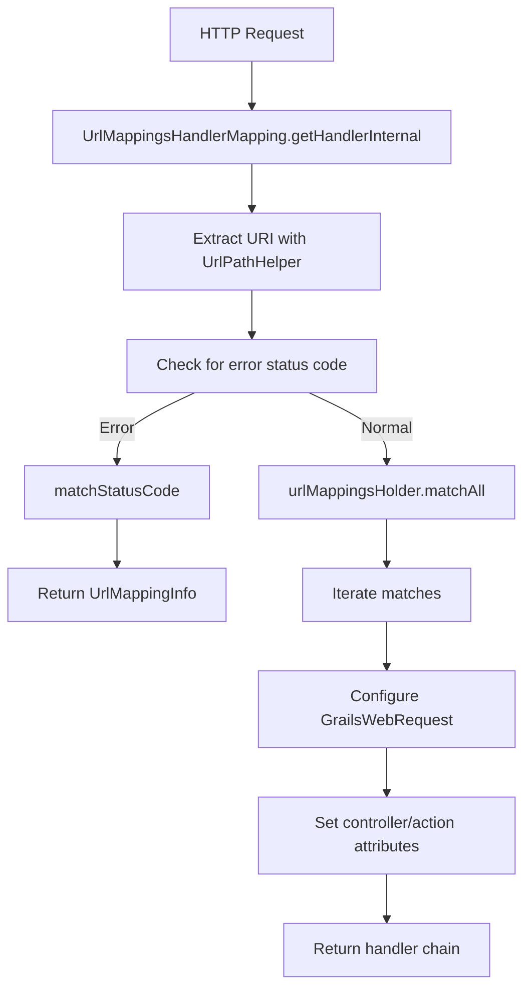

# Grace Web URL Mappings

## Module Overview

The `grace-web-url-mappings` module is the core URL routing and mapping infrastructure in the Grace Framework, responsible for decoupling the public URI structure from internal controller and action architecture through a DSL-based routing system.

## Important APIs

### Core Mapping Interfaces

- `UrlMapping` - Interface defining a URL mapping between a URI and controller/action/id, implementing Comparable for precedence rules
- `UrlMappingInfo` - Contains data produced when matching a URI with a UrlMapping instance (controller, action, parameters, etc.)
- `UrlMappingsHolder` - Main entry point for URL matching and reverse mapping operations
- `UrlMappings` - Extends UrlMappingsHolder to allow runtime registration of new mappings

### Implementation Classes

- `RegexUrlMapping` - Converts Grails URL patterns (Ant-style with capturing groups) into regex patterns for matching
- `DefaultLinkGenerator` - Service for generating URLs based on controller, action, and parameters
- `UrlMappingsHandlerMapping` - Spring MVC HandlerMapping that integrates Grace's URL mapping logic into the Spring MVC pipeline

### Parser and Factory

- `UrlMappingParser` - Parses Grails URL mapping patterns into UrlMappingData objects
- `UrlMappingsHolderFactoryBean` - Spring FactoryBean that creates UrlMappingsHolder from UrlMappings artefacts

## How It Works

The module implements a sophisticated URL routing system through the following process:

### 1. DSL Evaluation and Compilation

URL mappings are defined in `grails-app/mappings/UrlMappings.groovy` using a DSL that supports:

- Static mappings like `"/book/list"(controller:"book", action:"list")`
- Dynamic variables like `"/$controller/$action?/$id?"`
- RESTful resources via `resources` keyword
- HTTP status code mappings like `"500"(controller:"errors")`

### 2. Request Matching Pipeline

When a request arrives, `UrlMappingsHandlerMapping` processes it through Spring MVC:

The handler extracts the URI, checks for error status codes, and calls `urlMappingsHolder.matchAll(uri, method, version)` to find matching mappings.

### 3. Parameter Injection

When a match is found, the module resets the `GrailsWebRequest` parameters and populates them with variables captured from the URL pattern.

### 4. Link Generation

`DefaultLinkGenerator` provides reverse mapping to generate URLs from controller/action/parameter combinations, supporting context paths, server URLs, and resource mappings.

### 5. Interceptor Integration

The module integrates both Spring `HandlerInterceptor`s and Grace-specific `WebRequestInterceptor`s (like Hibernate OpenSessionInView) into the execution chain.

## Usage in Other Modules

The `grace-web-url-mappings` module is used by several other Grace modules:

| Module | Dependency Type | Purpose |
|--------|-----------------|---------|
| `grace-plugin-controllers` | api | Controller routing and request mapping |
| `grace-plugin-gsp` | api | GSP view resolution and link generation |
| `grace-plugin-rest` | api | REST endpoint routing and resource mapping |
| `grace-views-core` | api | View rendering with URL generation support |
| `grace-web-mvc` | api | MVC integration with URL mapping infrastructure |

## Notes

The module underwent significant refactoring in the 2024.x release to improve modularity:

- CORS-related functionality was relocated to `grace-plugin-url-mappings`
- `UrlMappingsErrorPageCustomizer` and `AnsiConsoleUrlMappingsRenderer` were moved to `grace-plugin-url-mappings`
- The `setGrailsCorsConfiguration()` method was removed from `UrlMappingsHandlerMapping` in favor of using `AbstractHandlerMapping.setCorsConfigurations()`

The module is configured via `UrlMappingsPluginConfiguration` which registers beans like `UrlMappingsHandlerMapping`, `LinkGenerator`, and `UrlMappingsHolderFactoryBean`.
